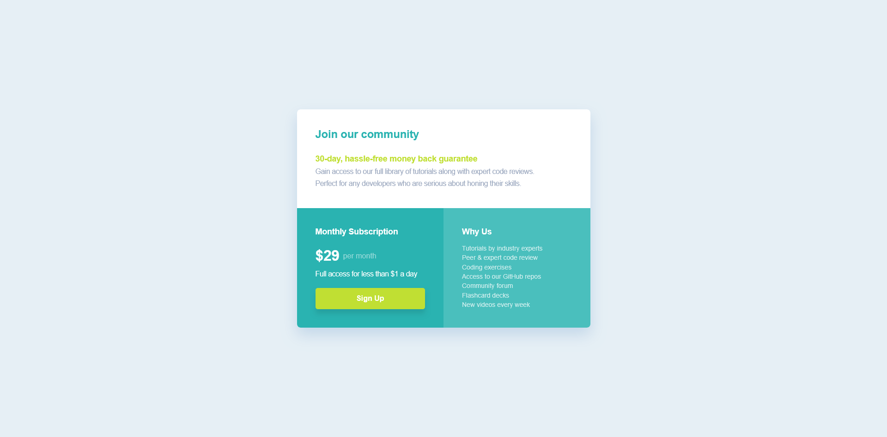

# Frontend Mentor - Single price grid component solution

This is a solution to the [Single price grid component challenge on Frontend Mentor](https://www.frontendmentor.io/challenges/single-price-grid-component-5ce41129d0ff452fec5abbbc). Frontend Mentor challenges help you improve your coding skills by building realistic projects. 

## Table of contents

- [Overview](#overview)
  - [The challenge](#the-challenge)
  - [Screenshot](#screenshot)
  - [Links](#links)
  - [Built with](#built-with)
  - [What I learned](#what-i-learned)
- [Author](#author)

## Overview

This is a responsive single price grid component where it allows you to practice making layouts using CSS Grid.

### The challenge

Users should be able to:

- View the optimal layout for the component depending on their device's screen size
- See a hover state on desktop for the Sign Up call-to-action

### Screenshot



### Links

- Solution URL: [Add solution URL here](https://your-solution-url.com)
- Live Site URL: [Add live site URL here](https://your-live-site-url.com)

### Built with

- Semantic HTML5 markup
- CSS custom properties
- Flexbox
- CSS Grid
- Mobile-first workflow
- [BEM](https://getbem.com/) - Block, Element, Modifier

### What I learned

I learned how to implement CSS Grid.

```css
.price-grid {
  display: grid;
  grid-template-columns: 1fr;
  max-inline-size: 39.688rem;
  border-radius: var(--rounded-sm);
  overflow: hidden;
  box-shadow: var(--shadow-sm);
}

@media screen and (min-width: 48em) {
  
  .price-grid {
    grid-template-columns: 1fr 1fr;
  }

  .header {
    grid-column: span 2;
  }

  .subscription__feature {
    margin-block-end: auto;
  }

}
```

## Author

- Website - [Schindler Dumagat](https://schindlerdumagat.github.io/webportfolio/)
- Frontend Mentor - [@schindlerdumagat](https://www.frontendmentor.io/profile/schindlerdumagat)
- LinkedIn - [schindler-dumagat-015238230](https://www.linkedin.com/in/schindler-dumagat-015238230/)
